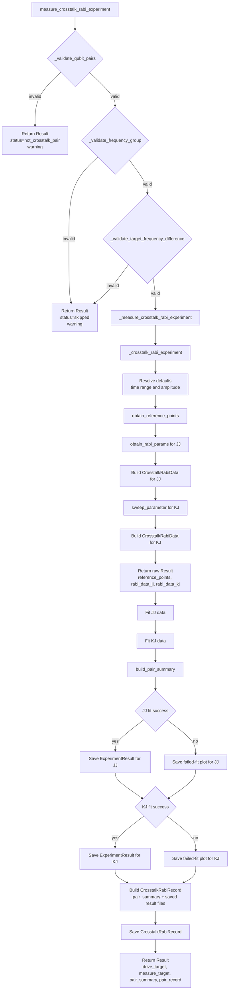
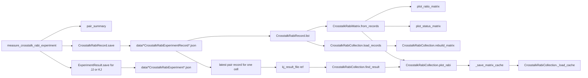

# Crosstalk Rabi Flow

## Measurement Flow

## Data and Artifact Flow

## Responsibility Split in Current Code

- `crosstalk_rabi_experiment.py`: validation, measurement execution, fit, `ExperimentResult` save, pair-level record save.
- `crosstalk_rabi_record.py`: internal pair-level persisted summary with JJ/KJ saved-file references.
- `crosstalk_rabi_result.py`: pair summary construction from fit outputs.
- `crosstalk_rabi_matrix.py`: matrix storage, jsonpickle persistence, record-to-matrix projection, status and ratio plotting.
- `crosstalk_rabi_collection.py`: matrix facade plus saved record loading, matrix rebuild, and `ExperimentResult` discovery.
- `crosstalk_rabi_status.py`: status code and label mapping.

## Current Coupling Points

- Validation failures are converted directly into public `Result` payloads in `measure_crosstalk_rabi_experiment`.
- `_measure_crosstalk_rabi_experiment` mixes orchestration with persistence side effects.
- matrix cache helpers are internal.
- `load_records()` is the primary collection entry point.
- `CrosstalkRabiCollection.find_result` now requires a record-backed collection so the returned result matches the matrix projection state.
- `CrosstalkRabiMatrix._update` depends on string status values produced by `CrosstalkRabiPairSummary`.